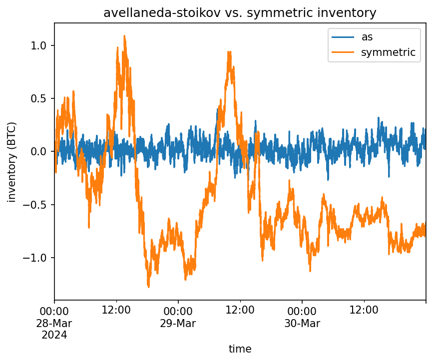
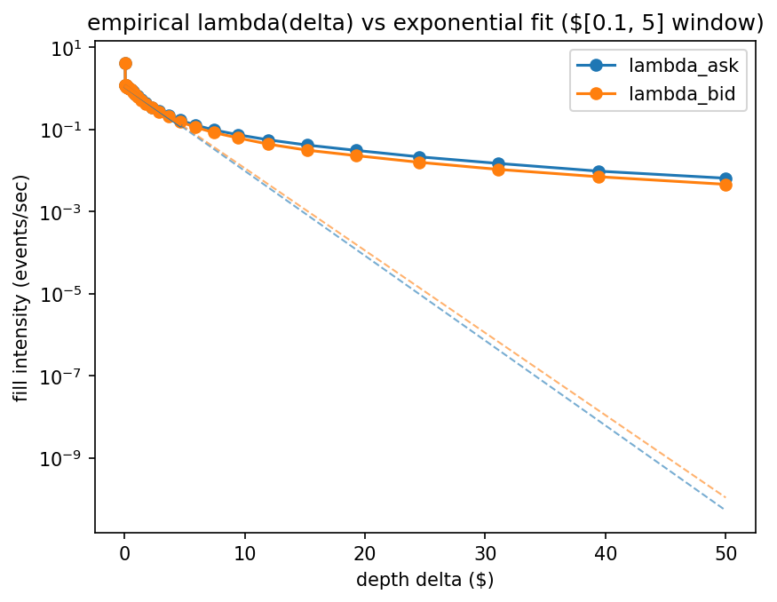
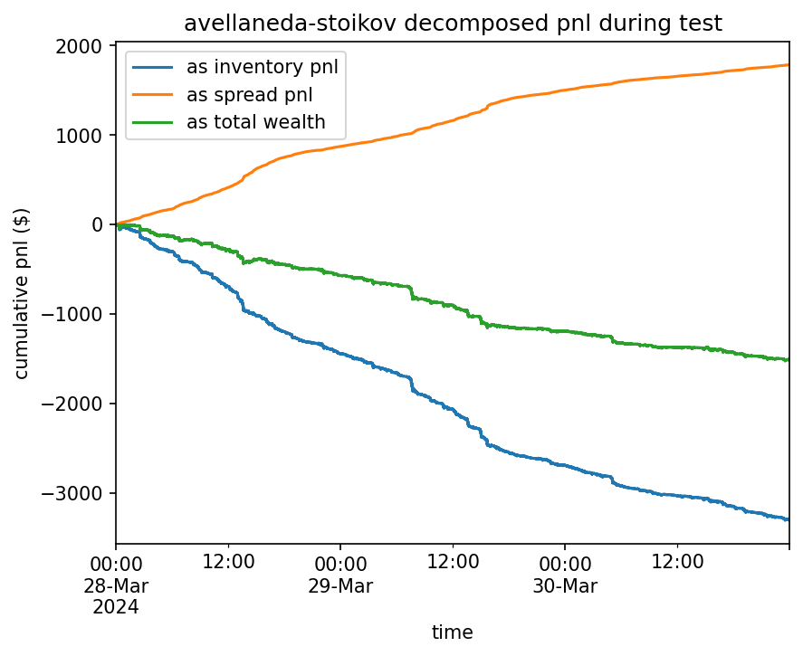
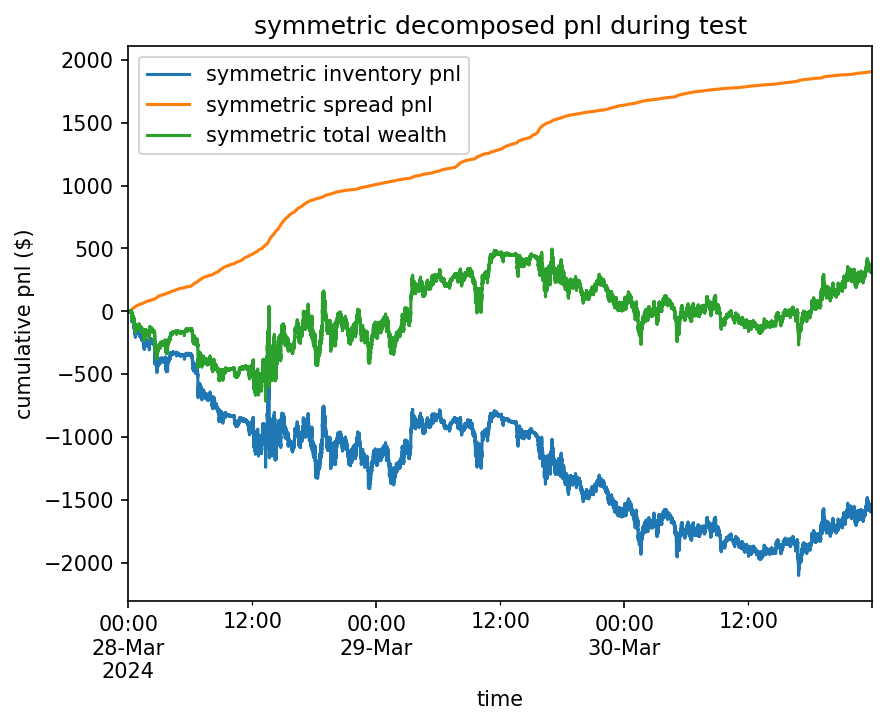

# Avellaneda-Stoikov Market Making on BTCUSDT Tick Data

**Author**: Akshath Pasam

**Stack**: Python (NumPy, Pandas, statsmodels)

---

## Overview

This project implements and validates the Avellaneda-Stoikov model on BTCUSDT tick data. Starting from raw L1 order-book and trade data,
the pipeline estimates all parameters (volatility, fill-intensity), computes reservation prices and optimal spreads with inventory-dependent
skew, and evaluates the strategy in a from-scratch backtester that replays market events. All model parameters were estimated from an 
in-sample dataset (March 24-27, 2024).

At a matched average spread, the Avellaneda-Stoikov model reduced inventory standard deviation **~20x** in-sample and **~6.5x** 
out-of-sample (March 28-30, 2024) versus quoting symmetrically around the mid-price. Both strategies lose money to adverse selection 
(~-$0.09/fill), and the primary result is reducing variance in inventory rather than profitability. Across the in-sample and out-of-sample
backtests, the A-S P&L varied by $0.7k while the matched symmetric quoting varied by $13.3k.

---

## Methodology

### 1. Data & Event Construction

- Binance bookTicker + aggTrades data from March 24-30, 2024
- Estimation data resampled to a uniform 1s mid-grid for time-series estimation
- Trades matched with mid-price using backward asof (excluding exact matches to capture pre-trade mid)
- Trade orders reconstructed using trade-id contiguity + 1ms gap-rule + aggressor switches to isolate events (7.7M trades -> 3.3M events)

### 2. Volatility Estimation

- σ estimated through EWMA of 1s mid increments
- Half-life tuned through QLIKE against τ-horizon realized variance (flat across 10min-15min)
- Grid frequency chosen through volatility signature plot; σ rises from 100ms to ~30s (short-horizon momentum) then declines (mean reversion beyond ~30s)

### 3. Fill Intensity

- λ(δ) survival counts per side
- Log-linear fit over $0.10-5; intensity at $50 exceeds fitted exponential by ~7 orders of magnitude (exponential holds locally, not globally)
- Bid and ask fits agreed closely (k within 3%), justifying pooling

### 4. Backtest

- Event-replay fill simulation, with fills coming from recorded market events (backtest inherits clustering / toxicity rather than Poisson approximation)
- Quotes computed at step t from information through t, eligible for fills from events in (t, t+1s]
- Filled quote is gone until the next step (one-shot quote lifecycle)
- Settlement at quoted price; sweeping event only determines whether model fills

---

## Results

### Train (March 24-27, 2024)

| Strategy | Terminal P&L | Spread Capture | Inventory P&L | Fills (bid/ask) | Mean Spread | Inventory σ | Max \|q\| |
|---|---|---|---|---|---|---|---|
| Avellaneda-Stoikov | -$2,235 | +$3,779 | -$6,014 | 25,516 / 25,518 | $17.87 | **0.059** | 0.31 |
| Symmetric (matched) | -$14,198 | +$4,304 | -$18,502 | 23,947 / 24,216 | $17.87 | **1.229** | 5.31 |

### Test (March 28-30, 2024)

| Strategy | Terminal P&L | Spread Capture | Inventory P&L | Fills (bid/ask) | Mean Spread | Inventory σ | Max \|q\| |
|---|---|---|---|---|---|---|---|
| Avellaneda-Stoikov | -$1,522 | +$1,787 | -$3,309 | 17,609 / 17,593 | $9.91 | **0.077** | 0.40 |
| Symmetric (matched) | +$386 | +$1,907 | -$1,522 | 19,206 / 19,274 | $9.91 | **0.501** | 1.28 |

Symmetric baseline quotes a fixed half-spread set to match A-S's realized average spread (matched to 9+ decimal places). P&L differs in sign
across windows, but inventory σ does not. 

### Figures

<em>Inventory over the test window. A-S (blue) holds near zero; symmetric (orange) drifts to ±1.3 BTC.</em>

<em>Empirical λ(δ) vs fitted exponential. At $50 depth, empirical intensity exceeds the fit by ~7 orders of magnitude.</em>

<em>A-S P&L decomposition, test window.</em>

<em>Symmetric P&L decomposition, test window. Inventory P&L is far more volatile than A-S's.</em>

# Gamma Selection

γ was selected by sweeping 10⁻⁴ to 10⁻² (8 log-spaced points, in-sample). Inventory σ falls monotonically with γ but saturates near 0.055 
for γ ≥ 7e-4, while fill count collapses from ~134k to ~170 across the range. Terminal P&L improves monotonically toward high γ, but only
because the strategy stops trading: the single profitable point (γ = 5.2e-3, +$12) quotes $102 average spreads and fills ~1,300 times over 
four days. γ = 7.2e-4 was chosen as the knee: the smallest γ achieving full inventory control, i.e. maximum market participation at the
control floor. Per-fill markout worsens monotonically with γ (−$0.087 -> −$0.435), consistent with deeper quotes being reachable only by 
adverse sweeps.

Full sweep results: [results/gamma_sweep.csv](results/gamma_sweep.csv)

